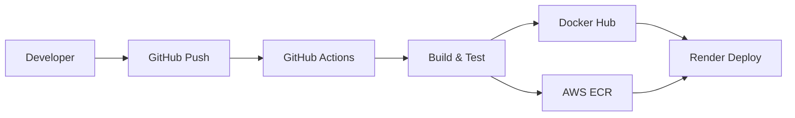

# Express.js CI/CD Pipeline

[](https://github.com/pranav-yaligouda/GitHub-Actions/actions)
[](https://hub.docker.com/r/pranavyaligouda/express-app)

A production-ready Node.js Express application with automated CI/CD pipeline featuring multi-registry deployment to Docker Hub and AWS ECR.

## 🎓 Learning Objectives

This project teaches:
- **GitHub Actions**: Workflow design, conditional logic, secrets management
- **Docker**: Multi-platform builds, security hardening, registry management
- **DevOps**: CI/CD patterns, automated testing, deployment strategies
- **AWS Integration**: ECR setup, IAM policies, enterprise container management
- **Local Development**: act tool simulation, environment configuration

## Architecture



## Technologies Stack

| Technology | Version | Purpose | Learning Focus |
|------------|---------|---------|----------------|
| **Node.js** | 22-alpine | Runtime Environment | ES6 modules, environment config |
| **Express.js** | 5.1.0 | Web Framework | REST API, middleware concepts |
| **Docker** | Latest | Containerization | Multi-platform builds, security |
| **GitHub Actions** | v4/v5 | CI/CD Pipeline | Workflow automation, conditional logic |
| **AWS ECR** | Latest | Enterprise Registry | IAM, enterprise container management |
| **Docker Hub** | Latest | Public Registry | Image distribution, versioning |
| **act** | Latest | Local Testing | GitHub Actions simulation |

## Features

- **Multi-Platform Builds**: AMD64 and ARM64 support
- **Dual Registry**: Docker Hub and AWS ECR deployment
- **Security Hardened**: Non-root containers, secret masking
- **Local Testing**: Complete CI/CD simulation with act
- **Health Monitoring**: Automated container health checks

## Quick Start

```bash
# Clone and setup
git clone https://github.com/pranav-yaligouda/GitHub-Actions.git
cd GitHub-Actions
npm install

# Local development
npm run dev

# Docker testing
docker build -t express-app .
docker run -p 8080:8080 -e PORT=8080 express-app
```

## Project Structure

```
GitHub-Actions/
├── .github/workflows/main.yaml    # CI/CD pipeline configuration
├── config/envconfig.js           # Environment configuration module
├── app.js                        # Express application entry point
├── Dockerfile                    # Container definition
├── package.json                  # Node.js dependencies and scripts
├── package-lock.json             # Dependency lock file
├── .env                          # Environment variables (gitignored)
├── .secrets                      # Local secrets for act testing (gitignored)
├── .dockerignore                 # Docker build optimization
└── .gitignore                    # Git ignore patterns
```

## CI/CD Pipeline

### Workflow Triggers
- **Push to main**: Full deployment pipeline
- **Pull Request**: Build and test only (no deployment)

### Pipeline Stages

| Stage | Description | Conditions |
|-------|-------------|------------|
| **Build** | Docker image creation | Always |
| **Test** | Health check validation | Always |
| **Multi-Platform Build** | AMD64/ARM64 compilation | Push only |
| **Registry Push** | Docker Hub + AWS ECR | Push only |
| **Deploy** | Render production deployment | Push only |

### Multi-Registry Strategy

```yaml
# Docker Hub
pranavyaligouda/express-app:latest
pranavyaligouda/express-app:${github.sha}

# AWS ECR
741916656498.dkr.ecr.ap-south-1.amazonaws.com/express-app:latest
741916656498.dkr.ecr.ap-south-1.amazonaws.com/express-app:${github.sha}
```

## Security Configuration

### Required Secrets

| Secret | Purpose | Required |
|--------|---------|----------|
| `DOCKER_USERNAME` | Docker Hub authentication | ✅ |
| `DOCKER_PASSWORD` | Docker Hub token | ✅ |
| `AWS_ACCESS_KEY_ID` | AWS ECR access | ✅ |
| `AWS_SECRET_ACCESS_KEY` | AWS ECR authentication | ✅ |
| `AWS_REGION` | AWS ECR region | ✅ |
| `RENDER_DEPLOY_HOOK` | Deployment webhook | ✅ |

### AWS ECR Setup

```bash
# Create ECR repository
aws ecr create-repository --repository-name express-app --region ap-south-1

# Create IAM user with ECR permissions
aws iam create-user --user-name github-actions-ecr
aws iam attach-user-policy --user-name github-actions-ecr --policy-arn arn:aws:iam::aws:policy/AmazonEC2ContainerRegistryPowerUser
aws iam create-access-key --user-name github-actions-ecr
```

## Local Testing

### Prerequisites
- Node.js 22+ (matches Docker image)
- Docker Desktop
- act (GitHub Actions runner)

### Setup act Tool

```powershell
# Windows (Chocolatey)
choco install act-cli

# macOS (Homebrew)
brew install act

# Linux
curl https://raw.githubusercontent.com/nektos/act/master/install.sh | sudo bash
```

### Configure Local Secrets

Create `.secrets` file:
```env
DOCKER_USERNAME=your-username
DOCKER_PASSWORD=your-token
AWS_ACCESS_KEY_ID=your-key
AWS_SECRET_ACCESS_KEY=your-secret
AWS_REGION=ap-south-1
RENDER_DEPLOY_HOOK=your-webhook-url
```

### Run Tests

```bash
# Test full pipeline
act push --secret-file .secrets

# Test PR workflow
act pull_request --secret-file .secrets

# List available workflows
act -l
```

## Docker Configuration

### Security Features
- Alpine Linux base (minimal attack surface)
- Non-root user execution
- Production-only dependencies
- Conditional deployment (PR safety)

### Multi-Platform Support
```dockerfile
FROM node:22-alpine
RUN addgroup app && adduser -S -G app app
WORKDIR /app
RUN chown -R app:app .
USER app
COPY package*.json ./
RUN npm ci --omit=dev
COPY . .
EXPOSE 8080
CMD ["npm", "start"]
```

## Monitoring

### Health Checks
```bash
# Application health
curl http://localhost:8080
# Expected: "Simple Express app for the CI/CD Actions"

# Container status during CI/CD
docker ps --filter "name=test-app"
```

### Registry Verification
- **Docker Hub**: [pranavyaligouda/express-app](https://hub.docker.com/r/pranavyaligouda/express-app)
- **AWS ECR**: `aws ecr list-images --repository-name express-app`

## Contributing

1. Fork the repository
2. Create feature branch: `git checkout -b feature-name`
3. Test locally: `act pull_request --secret-file .secrets`
4. Commit changes: `git commit -m "Add feature"`
5. Push branch: `git push origin feature-name`
6. Create Pull Request

## License

ISC License - see [LICENSE](LICENSE) file for details.

## Author

**Pranav Yaligouda** - [@pranav-yaligouda](https://github.com/pranav-yaligouda)

---

## 🎉 Learning Outcomes & Achievements

### 📚 **Educational Value**
- ✅ **Complete DevOps Workflow** - End-to-end automation understanding
- ✅ **Multi-Cloud Strategy** - Docker Hub + AWS ECR enterprise patterns  
- ✅ **Security Implementation** - Non-root containers, secret management, IAM policies
- ✅ **Local Development Mastery** - act tool simulation, environment parity
- ✅ **Modern JavaScript** - ES6 modules, environment configuration patterns
- ✅ **Container Optimization** - Multi-platform builds, Alpine security, dependency management

### 🏗️ **Production-Ready Skills**
- **GitHub Actions Expertise**: Conditional workflows, secret masking, marketplace actions
- **Docker Proficiency**: Security hardening, multi-platform builds, registry management  
- **AWS Integration**: ECR setup, IAM policies, enterprise container workflows
- **DevOps Best Practices**: Automated testing, deployment safety, monitoring strategies
- **Local Testing**: Complete CI/CD simulation without cloud dependency

### 🎯 **Enterprise Readiness**
This project demonstrates production-grade DevOps implementation suitable for:
- **Startup MVPs** - Quick deployment with comprehensive testing
- **Enterprise Applications** - Multi-registry, security-compliant workflows  
- **Learning Environments** - Complete local simulation and step-by-step progression
- **Interview Preparation** - Real-world DevOps patterns and modern tooling

**Perfect for**: DevOps learning, portfolio projects, production templates, and enterprise DevOps adoption.